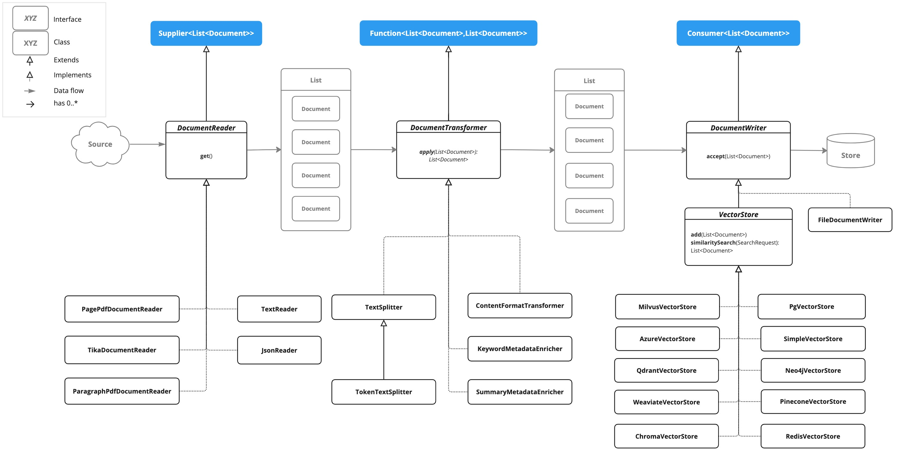

*ref*:
https://juejin.cn/post/7375525093266358313
https://ithelp.ithome.com.tw/m/articles/10346373
https://docs.spring.io/spring-ai/reference/1.0/api/etl-pipeline.html



pom.xml
```xml
<dependency>
    <groupId>org.springframework.ai</groupId>
    <artifactId>spring-ai-pdf-document-reader</artifactId>
</dependency>
```

<br>

PagePdfDocumentReader
```java
public List<Document> read(Resource resource){
    PagePdfDocumentReader pdfReader = new PagePdfDocumentReader(resource,
            PdfDocumentReaderConfig.builder()
                    .withPageTopMargin(0)
                    .withPageExtractedTextFormatter(ExtractedTextFormatter.builder()
                            .withNumberOfTopTextLinesToDelete(0)
                            .build())
                    .withPagesPerDocument(1)
                    .build());

    return pdfReader.read();
}
```