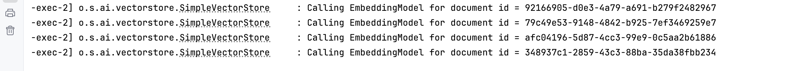

## spring ai vector store

[ref youtube](https://www.youtube.com/watch?v=azKntWC6d3w&list=PLO66QfE8gWT1lyNltpE73ee8mVn6C4xN9&index=3)

### simple vector store
pom.xml
```xml
<dependency>
    <groupId>org.springframework.ai</groupId>
    <artifactId>spring-ai-vector-store</artifactId>
</dependency>
```

VectorStoreConfig.java
```java
@Configuration
public class VectorStoreConfig {

    @Bean
    VectorStore vectorStore(EmbeddingModel embeddingModel) {
        return SimpleVectorStore.builder(embeddingModel).build();
    }
}
```

application.properties
```properties
spring.ai.openai.api-key=${OPENAI_API_KEY}
spring.ai.openai.embedding.options.model=text-embedding-3-small
```


## add vector
```java
import org.springframework.ai.document.Document;

public void addVector() {
    List<Document> documents = List.of(
            new Document("Spring AI rocks!! Spring AI rocks!! Spring AI rocks!! Spring AI rocks!! Spring AI rocks!!", Map.of("meta1", "meta1")),
            new Document("The World is Big and Salvation Lurks Around the Corner"),
            new Document("The World is Big"),
            new Document("You walk forward facing the past and you turn back toward the future.", Map.of("meta2", "meta2"))
    );

    //add documents to the vector store
    vectorStore.add(documents);
}
```


## query vector
```java
List<Document> results = vectorStore.similaritySearch(
        SearchRequest.builder()
                .query(query)
                .topK(2)
                .build()
);
```